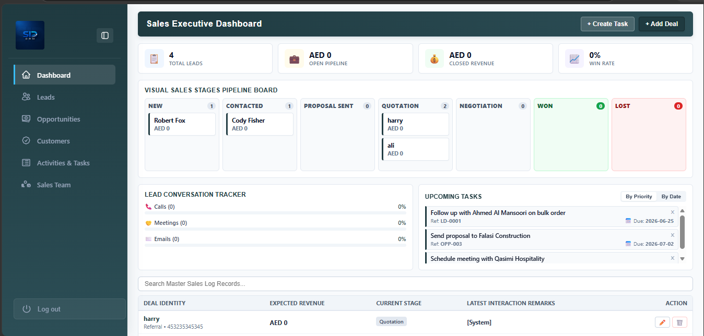
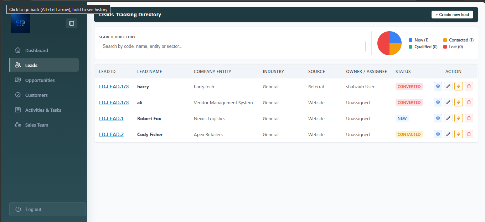
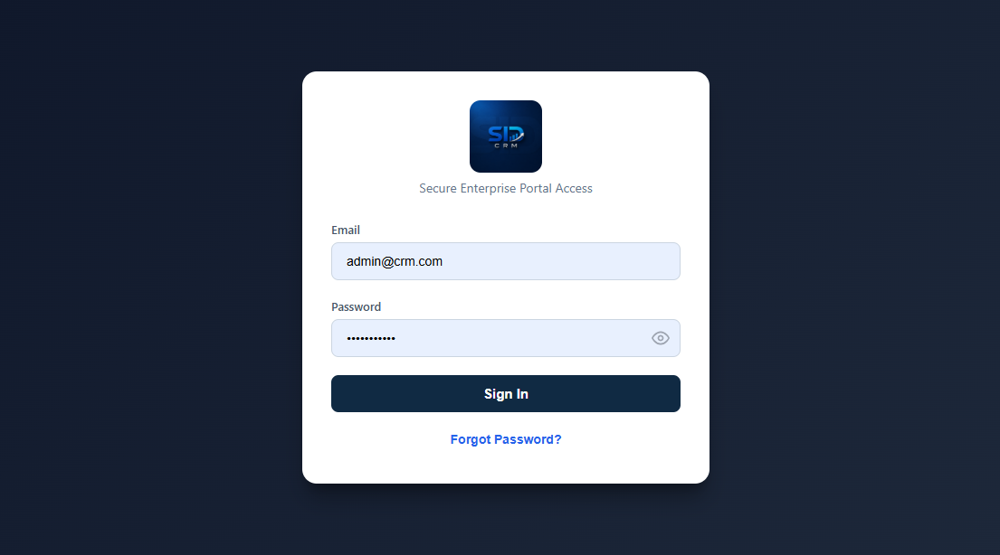

# Sentinel CRM

A modern Customer Relationship Management (CRM) application built with Angular. Manage customers, track interactions, and streamline your sales pipeline with a clean, responsive interface.


---

## 📸 Screenshots

### Dashboard


### Customer Management


### Login


---

## ✨ Features

- 🔐 Secure authentication
- 👥 Customer management (CRUD)
- 📊 Dashboard with analytics
- 🔍 Search and filter customers
- 📱 Fully responsive design
- 🎨 Modern UI with clean components

---

## 🛠️ Tech Stack

| Technology | Purpose |
|---|---|
| Angular | Frontend framework |
| TypeScript | Programming language |
| RxJS | Reactive state management |
| SCSS / CSS | Styling |
| Angular CLI | Build tooling |

---

## 🚀 Getting Started

### Prerequisites
- Node.js (v18+)
- npm or yarn
- Angular CLI (`npm install -g @angular/cli`)

### Installation

```bash
# Clone the repo
git clone https://github.com/zaibi137/sentinel-crm.git
cd sentinel-crm

# Install dependencies
npm install

# Start dev server
ng serve